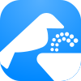

#  Bebedouros

**Ferramenta online para facilitar o acesso à água na cidade de Lisboa.**

- Criado por [bernzrdo](https://bernzrdo.wtf/)
- Dados fornecidos pela [Geodados CML](https://geodados-cml.hub.arcgis.com/datasets/d2eb1eb1cfae400496bec1aeec4e25b2/explore?filters=eyJUSVBPTE9HSUEiOlsiQmViZWRvdXJvIl19&layer=1)

*(Não afiliado com a Câmara Municipal de Lisboa.)*

## Sobre o Projeto

> "Um copo de água não se nega a ninguém".

Lisboa está repleta de bebedouros, o problema *era* saber onde eles estão. Embora existam dados abertos fornecidos pela Câmara Municipal, estes encontram-se alojados numa plataforma pouco intuitiva e imprópria para o uso diário.

O **Bebedouros** resolve este obstáculo. Perante a necessidade urgente durante a onda de calor do verão de 2026, esta ferramenta foi lançada para transformar dados estáticos numa interface útil para o povo, garantindo que o acesso à água seja um processo simples e direto.

## Funcionalidades

- [x] **Localização em tempo real:** Acesso à posição do utilizador para facilitar a navegação.
- [x] **Navegação externa:** Integração direta com aplicações de mapas da preferência do utilizador. (Google Maps, Apple Maps, etc.)

## Ética do Projeto
Esta ferramenta é *software* livre, desenvolvido por e para a comunidade. Não existem anúncios, telemetria ou extração de dados. A nossa prioridade é a autonomia tecnológica e o acesso universal, recusando a lógica da exploração de dados e o lucro sobre o utilizador.

**Licenciado sob [GNU GPLv3](https://choosealicense.com/licenses/gpl-3.0/)**

## Logótipo

O logótipo é uma junção de um dos corvos presente na [Marca da Câmara Municipal de Lisboa](https://www.lisboa.pt/municipio/camara-municipal/identidade-grafica) com o bebedouro da [AIGA](https://thenounproject.com/icon/drinking-fountain-29/).

## Mapa
- Criado com [Leaflet](https://leafletjs.com/)
- Mapa Padrão: &copy; [OpenStreetMap](http://www.openstreetmap.org/copyright) &copy; [CARTO](https://carto.com/attributions)
- Mapa Satélite: Esri, Vantor, Earthstar Geographics e a comunidade de utilizadores SIG.